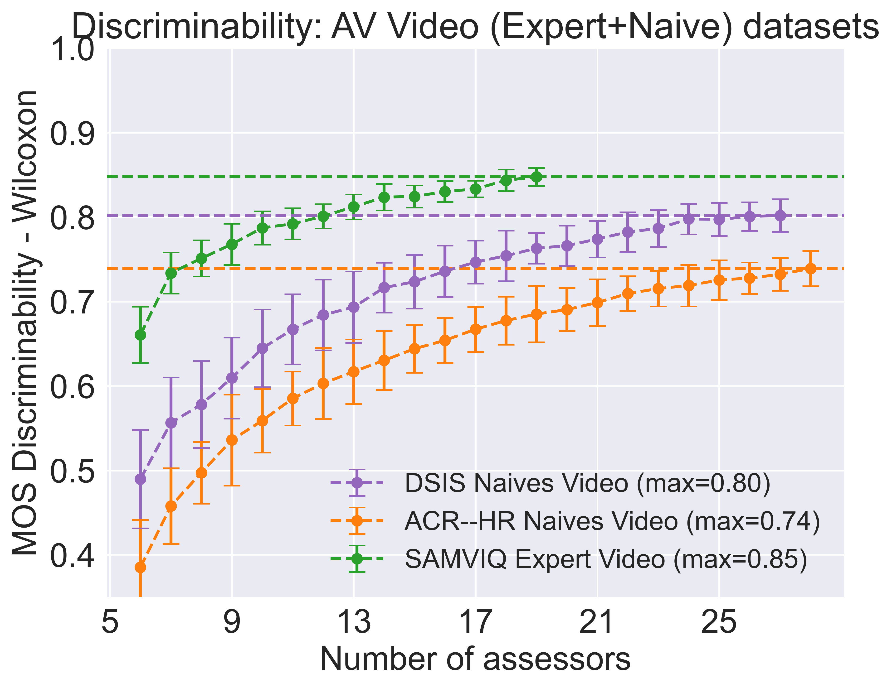
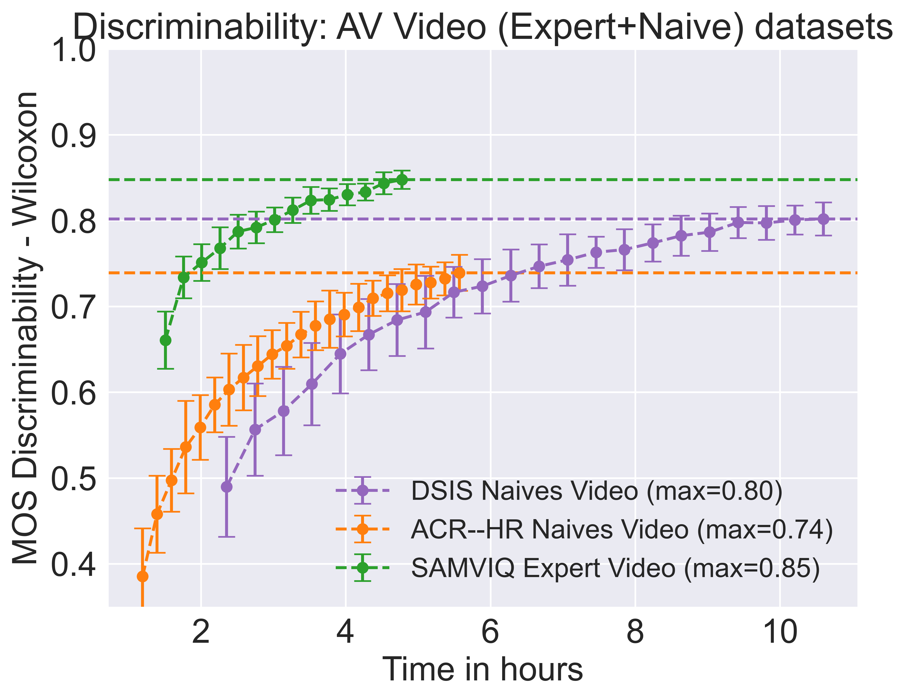

# Tool for the evaluation of discriminative power of methodologies for multimedia subjective quality assessment


This repository contains the code to analyse the discriminability between the subjective scores (e.g, MOS, JND, JOD, PD) obtained from a subjective test.

This tools is useful to validate the quality/relability of the subjective scores obtained from a subjective test. Example of this application can be found in the following paper:

```bibtex
Pastor, Andréas, and Patrick Le Callet. "Towards guidelines for subjective haptic quality assessment: A case study on quality assessment of compressed haptic signals." 2023 IEEE International Conference on Multimedia and Expo (ICME). IEEE, 2023.
```

A new multimedia applications like haptic feedbacks quality evaluation needs to be validated by a subjective test and a methodology appropriated to this modality needs to be validated. The validation of a methodology passes by the evaluation of the discriminative power of the subjective scores.

Moreover, the presented tool can be used to evaluate and compare efficiency of different methodologies for multimedia subjective quality assessment. Like the comparison of ACR-HR versus DCR-EVP for SDR and HDR video content.
```bibtex
Pastor, Andréas, et al. "“Discriminability–Experimental Cost” tradeoff in subjective video quality assessment of codec: DCR with EVP rating scale versus ACR–HR." 2024 Picture Coding Symposium (PCS). IEEE, 2024.
```
or the comparison of ACR-HR, DSIS, and SAMVIQ methodologies for 360° Audio-Visual content with spatial audio.

```bibtex
Pastor, Andréas, et al. "Comparison of subjective methodologies for local perception of distortion in videos and impact on objective metrics resolving power." (2024).
```
## Installation

The tool is implemented in Python 3.7 and requires the following packages:

- numpy
- json
- matplotlib
- scipy
- tqdm
- multiprocessing

To install the required packages, run the following command:

## Usage

Comments and examples are provided in the code. The analysis is performed by running the `analyzer.py` script. The script can be run with the following command:

```bash
python analyzer.py --n_sim 100 --step_size 1 --escape_thres 1 --type wilcoxon --filename ./datasets_json/360_AV_trained/AV_audio.json --out_filename ./discriminability_npy/discriminability_AV_audio-wilcoxon.npy --scaling SAMVIQ_0-100_to_DSIS_1-5 --cpu_count -1
```
where the arguments are:

- `n_sim`: number of simulations to perform
- `step_size`: step size between evaluated number of observers
- `escape_thres`: ratio of pairs included in the analysis (1: all pairs, 0.5: half of the pairs, etc.)
- `type`: type of test to perform (wilcoxon, ttest or variance test)
- `filename`: path to the JSON file containing the dataset in Netflix SUREAL format (link: https://github.com/Netflix/sureal/tree/master)
- `out_filename`: path to the output file where the results will be saved for later plotting
- `scaling`: scaling method to apply to the scores (e.g., SAMVIQ_0-100_to_DSIS_1-5 to scale SAMVIQ scores from 0-100 to DSIS scores from 1-5)
- `cpu_count`: number of CPU cores to use for the analysis (-1: all available cores)

The second script, `plot_results.py`, can be used to plot the results obtained from the analysis. The script can be run with the following command:

```bash
python plot_results.py --datasets "SAMVIQ Expert Audio" "SAMVIQ Expert Video" "SAMVIQ Expert AV" --filenames ./discriminability_npy/discriminability_AV_audio-wilcoxon.npy ./discriminability_npy/discriminability_AV_video-wilcoxon.npy ./discriminability_npy/discriminability_AV_AV-wilcoxon.npy --type_discri Wilcoxon --analysis_name "AV datasets" --type_of_scores MOS --type_of_particitants assessors
```
where the arguments are:
- `datasets`: list of the names of the datasets to appear in the plot
- `filenames`: list of the paths to the output files obtained from the analysis
- `type_discri`: type of test performed in the analysis to appear in the plot
- `analysis_name`: name of the analysis to appear in the plot
- `type_of_scores`: type of scores used in the analysis to appear in the plot (e.g., MOS, JND, JOD, PD)
- `type_of_particitants`: type of participants used in the analysis to appear in the plot (e.g., assessors, experts, observers)


## Examples
Example of the results obtained from the analysis of the discriminative power of 3 methodologies for 360° Audio-Visual content with spatial audio:

### First example:




The results show that the SAMVIQ methodology with trained assessors has the highest discriminative power, followed by the DSIS methodology with naive assessors and the ACR-HR methodology with naive assessors. The results also show that the discriminative power of the methodologies increases with the number of assessors.


### Second example:




Here the analysis is performed with the time as the x-axis. This allows to see which methodology is the most efficient in terms of experimental effort to provide the same discriminative power. Time can be related to the amount of money spent on the subjective test to recruit assessors, immobilize the equipment, etc. The results shows that the ACR-HR methodology with naive assessors is more efficient than the DSIS methodology. 
SAMVIQ methodology with already trained assessors is the most efficient in terms of experimental effort, but the time to train the assessors is not taken into account in this analysis, only the time of the actual subjective test. (More details in the referenced papers)


## References

The following papers are related to the tool and can be cited if you use it:

```bibtex
@inproceedings{pastor2023towards,
  title={Towards guidelines for subjective haptic quality assessment: A case study on quality assessment of compressed haptic signals},
  author={Pastor, Andr{\'e}as and Le Callet, Patrick},
  booktitle={2023 IEEE International Conference on Multimedia and Expo (ICME)},
  pages={1667--1672},
  year={2023},
  organization={IEEE}
}

@inproceedings{pastor2024discriminability,
  title={“Discriminability--Experimental Cost” tradeoff in subjective video quality assessment of codec: DCR with EVP rating scale versus ACR--HR},
  author={Pastor, Andr{\'e}as and David, Pierre and Katsavounidis, Ioannis and Krasula, Luk{\'a}{\v{s}} and Norkin, Andrey and Tmar, Hassene and Le Callet, Patrick},
  booktitle={2024 Picture Coding Symposium (PCS)},
  pages={1--5},
  year={2024},
  organization={IEEE}
}

@inproceedings{pastor2024comparison,
  title={Comparison of conditions for omnidirectional video with spatial audio in terms of subjective quality and impacts on objective metrics resolving power},
  author={Pastor, Andreas and Lebreton, Pierre and Vigier, Toinon and Le Callet, Patrick},
  booktitle={ICASSP 2024-2024 IEEE International Conference on Acoustics, Speech and Signal Processing (ICASSP)},
  pages={8210--8214},
  year={2024},
  organization={IEEE}
}
``` 

## Presentations

The tool was presented at the following conference's presentations:

- [Comparison of conditions for omnidirectional video with spatial audio in terms of subjective quality and impacts on objective metrics resolving power
](https://docs.google.com/presentation/d/1I3Om-Vt8I6DgDkEKZNmxCnqbU1KdQzDKHODzFqSlee0/edit?usp=sharing)
- [“Discriminability–Experimental Cost” tradeoff in subjective video quality assessment of codec: DCR with EVP rating scale versus ACR–HR](https://docs.google.com/presentation/d/1MJMc-8H1FQTXO6racokP1H89aCNbg5p94FAIFnKfq_Y/edit?usp=sharing)